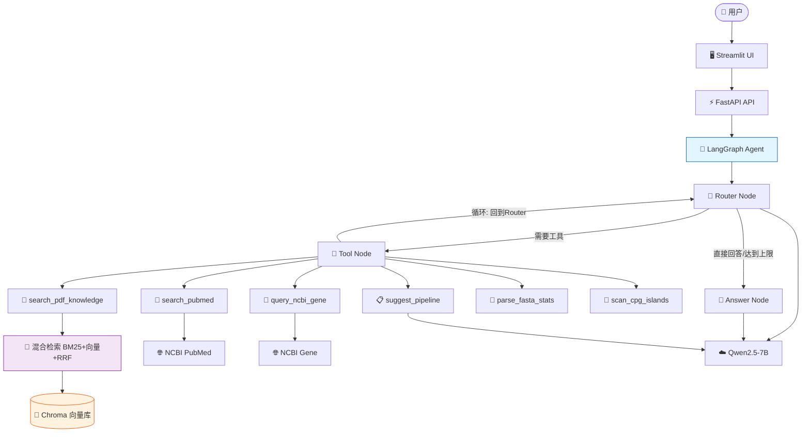
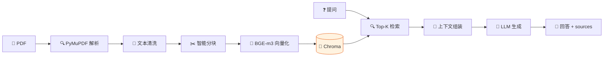
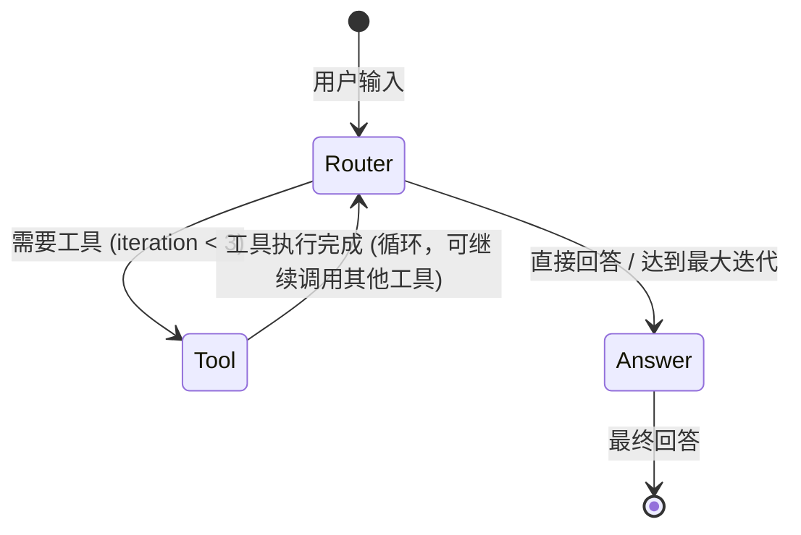

# 🌱 PlantGenome Agent

> 面向植物比较基因组研究的 PDF-RAG + Tool Calling 智能体

基于 FastAPI、LangGraph、Chroma 和 Streamlit 构建的植物基因组研究助手，支持 PDF 文献自动解析入库、RAG 检索问答、Agent 自动意图路由与生信工具调用（FASTA 统计、CpG 岛扫描、分析流程推荐）。

---

## ✨ 核心功能

- 📄 **PDF 文献自动解析与知识库构建** — PyMuPDF 双模式提取 + Markdown 智能分块（标题层次感知 + BGE-m3 Token 精确控制）+ Chroma 向量库
- 🔍 **混合检索 RAG（BM25 + 向量 + RRF 融合）** — 语义向量召回 + BM25 关键词重排 + Reciprocal Rank Fusion 融合，兼顾语义理解和精确匹配，显著提升召回率
- 🌐 **PubMed 一键检索下载入库** — 输入关键字，自动从 PubMed 搜索文献、下载全文 PDF（Europe PMC 直链）、无全文时用摘要生成 PDF，自动走 RAG 入库流水线
- 🔎 **PubMed Agent 工具集成** — Agent 可自动调用 search_pubmed 工具搜索全网文献元数据，与已入库文献检索形成互补
- 🧬 **NCBI 基因信息查询** — Agent 可自动调用 query_ncbi_gene 工具，通过 NCBI E-utilities 查询基因名/Locus Tag 对应的基因信息（功能、位置、物种、别名）
- 🔄 **多工具链式调用（循环边）** — LangGraph 循环架构，tool 执行后回到 router，可连续调用多个工具（最多 3 次迭代），支持复杂任务的多步骤推理
- 🤖 **LangGraph Agent 自动意图路由** — Router-Tool-Answer 循环状态机，7 类意图分类，自动选择并调用工具，防重复调用保护
- 🧰 **6 个生信工具** — 文献知识检索、PubMed 搜索、NCBI 基因查询、FASTA 序列统计、CpG 岛扫描、分析流程推荐
- 🖥️ **Streamlit 交互界面** — 聊天问答 + PDF 上传 + PubMed 检索面板 + 工具结果结构化展示 + Agent 执行过程可视化
- ⚡ **大序列性能优化** — 纯计算工具（FASTA/CpG）前端直接调用，绕过 LLM，毫秒级响应，大序列不卡死

---

## 🏗️ 系统架构

### 系统架构图



### PDF RAG 流水线



### Agent 状态机（多工具链式调用）



> **多工具链式调用**：tool 执行后回到 router，可连续调用多个工具（最多 3 次迭代）。router 基于已调用工具历史判断是否需要继续，防止重复调用。当 router 返回 direct_answer 或达到最大迭代次数时，跳到 answer 结束。

> 完整架构图（含详细说明）见 [docs/architecture.md](docs/architecture.md)

---

## 🛠️ 技术栈

| 类别 | 技术 | 说明 |
|------|------|------|
| 语言 | Python 3.12 | 主开发语言 |
| 后端 | FastAPI + Uvicorn | REST API 服务 |
| Agent | LangGraph 1.2 | 循环状态机 Agent 框架（支持多工具链式调用） |
| RAG 向量检索 | Chroma + BGE-m3 | 向量数据库 + 中英文混合 embedding |
| RAG 混合检索 | BM25 + RRF | 关键词检索 + Reciprocal Rank Fusion 融合排序 |
| PDF 解析 | PyMuPDF | 文本 + Markdown 双模式提取 |
| PDF 生成 | fpdf2 | PubMed 摘要兜底生成 PDF |
| 文献检索 | NCBI E-utilities + Europe PMC | PubMed 搜索 + 全文 PDF 下载 |
| 基因查询 | NCBI E-utilities Gene DB | 基因名/Locus Tag 信息查询 |
| 前端 | Streamlit | Python 原生交互界面 |
| LLM | 硅基流动 API | Qwen2.5-7B-Instruct（OpenAI 兼容格式） |
| 测试 | pytest + 自定义脚本 | 单元测试 + 端到端测试 + 评估脚本 |

---

## 🚀 快速开始

### 方式一：Docker（推荐）

```bash
# 1. 克隆项目
git clone <your-repo-url>
cd plantgenome-agent

# 2. 配置环境变量
cp .env.example .env
# 编辑 .env，填入你的 LLM API Key

# 3. 构建并启动
docker compose build
docker compose up -d

# 4. 访问
# 前端: http://localhost:8501
# 后端 API: http://localhost:8000/docs
```

> 注意：首次启动会自动下载 BGE-m3 模型（约 2.3GB），请耐心等待。国内用户建议在 `.env` 中设置 `HF_ENDPOINT=https://hf-mirror.com`。

### 方式二：本地运行

#### 环境要求

- Python 3.10+
- conda 或 venv（推荐 conda）
- 一个 OpenAI 兼容格式的 LLM API Key（推荐硅基流动，有免费额度）

#### 步骤

```bash
# 1. 克隆项目
git clone https://github.com/Fengye-01/plantgenome-agent.git
cd plantgenome-agent

# 2. 创建并激活虚拟环境
conda create -n plantgenome-agent python=3.12
conda activate plantgenome-agent

# 3. 安装依赖
pip install -r requirements.txt

# 4. 配置环境变量
cp .env.example .env
# 编辑 .env，填入你的 LLM API Key（LLM_API_KEY）

# 5. 初始化数据库（SQLite，零配置）
python scripts/init_db.py
# 默认账号: admin / admin123

# 6. 准备知识库（可选，把 PDF 放入 data/pdfs/ 后批量入库）
$env:HF_ENDPOINT = "https://hf-mirror.com"
python scripts/ingest_all_pdfs.py

# 7. 启动后端
python -m app.api.main
# 后端运行在 http://localhost:8000

# 8. 启动前端（另开一个终端）
streamlit run frontend/app.py --server.port 8501 --server.fileWatcherType none
# 前端运行在 http://localhost:8501
```

> **数据库说明**：默认使用 SQLite（零配置，`data/plantgenome.db`），无需安装 PostgreSQL。如需切换到 PostgreSQL，修改 `.env` 中 `DATABASE_URL` 即可（模型已兼容 JSON 类型）。

> **默认账号**：`admin` / `admin123`（登录后即可使用所有功能）

### 💡 示例问题

登录后可以直接尝试以下问题，展示不同能力：

| 问题 | 展示能力 |
|------|----------|
| `PAML codeml 怎么设置分支模型？` | RAG 文献检索（混合检索）+ 来源引用 |
| `帮我搜索一下植物 mTERF 基因家族的最新研究文献` | PubMed 全网搜索工具 |
| `查一下 AT1G01010 这个基因` | NCBI 基因查询工具 |
| `研究 mTERF 家族进化需要什么流程？` | 生信流程推荐工具 |
| 粘贴一段 FASTA 序列问"统计一下这个序列" | FASTA 序列分析工具 |
| `这个序列有多少 CpG 岛？` | CpG 岛识别工具 |
| 左侧 PubMed 面板输入关键字下载文献 | PubMed 一键下载入库 RAG |

---

## 📊 评估结果

### 检索评估（三模式，离线）

系统支持三种检索模式，由环境变量 `RETRIEVAL_MODE` 控制：

| 模式 | 说明 | 默认 |
|------|------|------|
| `dense_only` | 纯 BGE-m3 向量召回 + distance 门控 | |
| `candidate_rrf` | Dense 候选集内 BM25 重排 + RRF | ✅ 默认 |
| `global_rrf` | 用户全库 Dense / BM25 **各自独立召回** + RRF（已实现） | |

**离线评估结果（隔离环境，12 篇 PDF、18 条可回答问题）：**

| 指标 | dense_only | candidate_rrf | global_rrf |
|------|-----------|---------------|-----------|
| HitRate@1 | 77.8% | 83.3% | **88.9%** |
| HitRate@3 | 94.4% | 94.4% | 94.4% |
| HitRate@5 | 94.4% | 94.4% | 94.4% |
| MRR | 0.843 | 0.880 | **0.907** |

> `global_rrf` **已实现并完成离线评估**：首位命中率 HitRate@1 从 77.8% 提升到 88.9%、MRR 从 0.843 提升到 0.907；热查询延迟与其他模式相当（约 160ms，首次快照冷构建约 290ms）。**但默认模式仍为 `candidate_rrf`**，可按需通过环境变量切换为 `global_rrf`。

**评估口径与局限（务必注意）：**

- 上述指标来自隔离环境中重新规范入库的 **12 篇 PDF、18 条可回答问题**，样本规模小，**不能代表完整线上效果**。
- **纯中文 Case 18 仍然失败**：中文 query"正选择/纯化选择"中，英文 BM25 tokenizer 丢弃中文字符、词法召回失效，Dense 也存在语义偏移；详见 [docs/failure_cases.md](docs/failure_cases.md)。
- 历史 `data/chroma` 早期向量（SQL 无对应记录、ID 含 UUID）未纳入本次评估。

### 端到端 Agent 评估（100 条用例）

| 指标 | 数值 |
|------|------|
| 工具调用准确率 | **96%**（96/100） |
| 已知错误 | 4 条，全部为 Router 把需工具调用的问题误判为 direct_answer |
| 平均响应时间 | 14.6s |

### 已知失败 case

- **Case 18（跨语言召回失败）**：中文 query"正选择/纯化选择"未能召回英文 PAML 论文证据，BGE-m3 跨语言对齐不完美，BM25 字面匹配失效
- **路由误判**：泛化表述（如"基因家族功能是什么"）容易被 7B 模型判为 direct_answer

> 评估方法见 [docs/evaluation_methods.md](docs/evaluation_methods.md)，原始数据见 [docs/evaluation_results.json](docs/evaluation_results.json)

---

## 📁 项目结构

```
plantgenome-agent/
├── app/
│   ├── api/
│   │   └── main.py              # FastAPI 入口（GET /health + POST /chat）
│   ├── core/
│   │   ├── llm.py               # LLM 封装（think/invoke/stream 三方法）
│   │   ├── tools.py             # ToolExecutor 工具注册与调度
│   │   └── config.py            # 配置管理
│   ├── agents/
│   │   ├── state.py             # AgentState 定义 + 7 类意图常量 + 工具历史/迭代计数
│   │   ├── nodes.py             # router_node / tool_node / answer_node（支持多轮循环）
│   │   ├── graph.py             # LangGraph 循环图构建 + run_agent（多工具链式调用）
│   │   └── tool_registry.py     # 6 个工具注册
│   ├── rag/
│   │   ├── pdf_parser.py        # PDF 解析（纯文本 + Markdown 双模式）
│   │   ├── text_cleaner.py      # 文本清洗（两阶段，9 个噪声正则）
│   │   ├── chunker.py           # Markdown 智能分块（4 大策略）
│   │   ├── vector_store.py      # 向量存储（BGE-m3 + Chroma 持久化）
│   │   ├── bm25_store.py        # BM25 索引 + RRF 融合 + hybrid_search（混合检索）
│   │   ├── retriever.py         # 检索封装（Top-K + sources 组装）
│   │   ├── context_builder.py   # 上下文工程（GSSC 流水线）
│   │   └── rag_generator.py     # RAG 生成器（检索 + 上下文 + LLM）
│   └── tools/
│       ├── search_pdf_knowledge.py  # RAG 混合检索工具（BM25+向量+RRF）
│       ├── pubmed_search_tool.py    # PubMed 搜索工具（Agent 用，返回元数据）
│       ├── ncbi_gene_query.py       # NCBI 基因信息查询工具
│       ├── fasta_stats.py           # FASTA 统计工具
│       ├── cpg_island.py            # CpG 岛扫描工具
│       ├── pipeline_suggest.py      # 流程推荐工具
│       └── pubmed_fetcher.py        # PubMed 检索下载模块（搜索+全文下载+摘要兜底）
├── frontend/
│   └── app.py                 # Streamlit 前端（聊天 + 工具面板 + 执行过程可视化）
├── scripts/
│   └── ingest_all_pdfs.py     # 批量 PDF 入库脚本
├── tests/
│   ├── retrieval_evaluation.py    # 检索效果评估（15 题）
│   ├── test_rag_e2e.py            # RAG 端到端测试（5 题）
│   ├── test_router.py              # Router 分类测试（10 题）
│   ├── test_tool_node.py           # Tool Node 测试（6 题）
│   ├── test_agent_e2e.py          # Agent 端到端测试（5 题）
│   └── stability_test.py           # 稳定性测试脚本
├── docs/
│   ├── architecture.md          # 3 张架构图（Mermaid）
│   ├── demo_cases.md            # 10 个 Demo Case
│   ├── failure_cases.md         # 5 个 Failure Case
│   ├── performance.md           # 性能基线
│   ├── evaluation_methods.md    # 评估方法预习（第12章）
│   ├── prompt_optimization.md   # Prompt 优化记录（三轮 A/B）
│   └── packing_checklist.md     # 第3周包装素材清单
├── data/
│   ├── pdfs/                    # PDF 文献存放目录
│   └── chroma/                  # Chroma 向量库持久化目录
├── .env.example                 # 环境变量模板
├── requirements.txt             # Python 依赖
└── README.md                    # 本文件
```

---

## 📝 Demo 用例

10 个稳定可演示的用例，覆盖 4 类意图 + 边界场景：

| # | 场景 | 意图 | 工具 |
|---|------|------|------|
| 1 | PAML omega 解释 | literature_search | search_pdf_knowledge |
| 2 | OrthoFinder 输入格式 | literature_search | search_pdf_knowledge |
| 3 | MAFFT 算法选择 | literature_search | search_pdf_knowledge |
| 4 | mTERF 家族功能 | literature_search | search_pdf_knowledge |
| 5 | FASTA 序列统计 | fasta_analysis | parse_fasta_stats |
| 6 | CpG 岛扫描（阳性） | cpg_scan | scan_cpg_islands |
| 7 | CpG 岛扫描（阴性） | cpg_scan | scan_cpg_islands |
| 8 | mTERF 进化流程推荐 | pipeline_suggest | suggest_pipeline |
| 9 | 选择压力分析流程 | pipeline_suggest | suggest_pipeline |
| 10 | 直接问候 | direct_answer | （无工具） |

> 详细用例说明见 [docs/demo_cases.md](docs/demo_cases.md)，边界用例见 [docs/failure_cases.md](docs/failure_cases.md)

---

## ⚠️ 局限性与 Future Work

### 当前版本的局限

- 主要处理文本型 PDF，扫描件 OCR 和复杂表格解析待实现
- 无多轮对话记忆，每次对话独立
- Gold Set 规模较小（35 题，其中 18 条可回答），统计显著性有限
- 跨语言召回存在失败 case（中文 query 搜英文论文）
- 聊天接口当前为同步实现，高并发性能有限
- 7B 模型在复杂推理和 JSON 输出上偶有不稳定

### Future Work

- 🔍 **高级检索策略**：MQE（多查询扩展）+ HyDE（假设文档嵌入），已预留接口
- 🔀 **Reranker 精排**：知识库规模扩大后加入 BGE-reranker
- 📊 **RAGAS 自动化评估**：Faithfulness / Context Precision / Answer Relevancy
- 🧠 **多轮对话记忆**：引入 Memory 模块，支持上下文延续
- 📄 **Marker/GROBID 论文结构化解析**：表格提取 + 图片 caption + 参考文献识别
- 🔌 **MCP 协议支持**：外部工具动态接入，替代硬编码注册
- 🧬 **生信软件真实执行**：MAFFT / OrthoFinder / PAML / eggNOG 容器化执行
- 🤝 **多 Agent 协作**：研究规划 Agent + 执行 Agent + 评审 Agent
- ☁️ **云服务部署**：Hugging Face Spaces / 阿里云 / 腾讯云

---

## 📄 许可证

MIT License

---

## 🙏 致谢

- [Datawhale Hello Agents](https://github.com/datawhalechina/hello-agents) — 本项目参考的教程
- [LangGraph](https://github.com/langchain-ai/langgraph) — Agent 状态机框架
- [Chroma](https://github.com/chroma-core/chroma) — 向量数据库
- [BGE-m3](https://huggingface.co/BAAI/bge-m3) — 中英文混合 embedding 模型
- [PyMuPDF](https://github.com/pymupdf/PyMuPDF) — PDF 解析库
