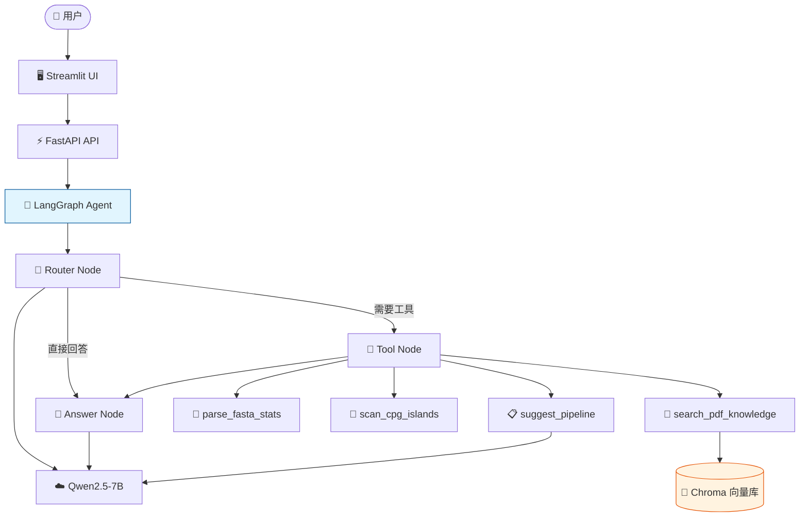
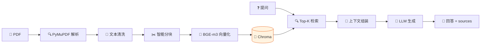
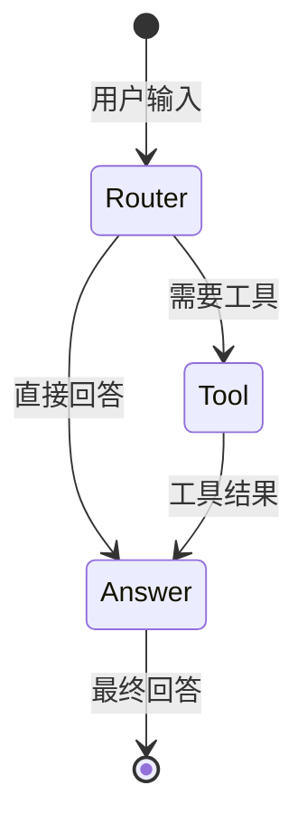

# 🌱 PlantGenome Agent

> 面向植物比较基因组研究的 PDF-RAG + Tool Calling 智能体

基于 FastAPI、LangGraph、Chroma 和 Streamlit 构建的植物基因组研究助手，支持 PDF 文献自动解析入库、RAG 检索问答、Agent 自动意图路由与生信工具调用（FASTA 统计、CpG 岛扫描、分析流程推荐）。

---

## ✨ 核心功能

- 📄 **PDF 文献自动解析与知识库构建** — PyMuPDF 双模式提取 + Markdown 智能分块（标题层次感知 + BGE-m3 Token 精确控制）+ Chroma 向量库
- 🔍 **基于 RAG 的文献检索问答** — BGE-m3 语义检索 + Top-K 召回 + 回答带 sources 来源引用，有效抑制幻觉
- 🤖 **LangGraph Agent 自动意图路由** — Router-Tool-Answer 三阶段状态机，5 类意图分类，自动选择并调用工具
- 🧬 **4 个生信工具** — FASTA 序列统计、CpG 岛滑动窗口扫描、分析流程推荐、文献知识检索
- 🖥️ **Streamlit 交互界面** — 聊天问答 + PDF 上传 + 工具结果结构化展示 + Agent 执行过程可视化
- ⚡ **大序列性能优化** — 纯计算工具（FASTA/CpG）前端直接调用，绕过 LLM，毫秒级响应，大序列不卡死

---

## 🏗️ 系统架构

### 系统架构图



### PDF RAG 流水线



### Agent 状态机



> 完整架构图（含详细说明）见 [docs/architecture.md](docs/architecture.md)

---

## 🛠️ 技术栈

| 类别 | 技术 | 说明 |
|------|------|------|
| 语言 | Python 3.12 | 主开发语言 |
| 后端 | FastAPI + Uvicorn | REST API 服务 |
| Agent | LangGraph 1.2 | 状态机 Agent 框架 |
| RAG | Chroma + BGE-m3 | 向量数据库 + 中英文混合 embedding |
| PDF 解析 | PyMuPDF | 文本 + Markdown 双模式提取 |
| 前端 | Streamlit | Python 原生交互界面 |
| LLM | 硅基流动 API | Qwen2.5-7B-Instruct（OpenAI 兼容格式） |
| 测试 | pytest + 自定义脚本 | 单元测试 + 端到端测试 + 评估脚本 |

---

## 🚀 快速开始

### 方式一：Docker（推荐）

```bash
# 1. 克隆项目
git clone <your-repo-url>
cd plantgenome-agent

# 2. 配置环境变量
cp .env.example .env
# 编辑 .env，填入你的 LLM API Key

# 3. 构建并启动
docker compose build
docker compose up -d

# 4. 访问
# 前端: http://localhost:8501
# 后端 API: http://localhost:8000/docs
```

> 注意：首次启动会自动下载 BGE-m3 模型（约 2.3GB），请耐心等待。国内用户建议在 `.env` 中设置 `HF_ENDPOINT=https://hf-mirror.com`。

### 方式二：本地运行

#### 环境要求

- Python 3.10+
- conda 或 venv（推荐 conda）
- 一个 OpenAI 兼容格式的 LLM API Key（推荐硅基流动，有免费额度）

#### 步骤

```bash
# 1. 克隆项目
git clone <your-repo-url>
cd plantgenome-agent

# 2. 创建并激活虚拟环境
conda create -n plantgenome-agent python=3.12
conda activate plantgenome-agent

# 3. 安装依赖
pip install -r requirements.txt

# 4. 配置环境变量
cp .env.example .env
# 编辑 .env，填入你的 LLM API Key

# 5. 准备知识库（把 PDF 放入 data/pdfs/，然后批量入库）
$env:HF_ENDPOINT = "https://hf-mirror.com"
python scripts/ingest_all_pdfs.py

# 6. 启动后端
python -m app.api.main
# 后端运行在 http://localhost:8000

# 7. 启动前端（另开一个终端）
streamlit run frontend/app.py --server.port 8502 --server.fileWatcherType none
# 前端运行在 http://localhost:8502
```

---

## 📊 评估结果

在自建 20 条测试集上的评估结果（2026-09-10）：

| 指标 | 数值 | 说明 |
|------|------|------|
| 工具调用准确率 | 95.0% (19/20) | Agent 自动选择正确工具的比例 |
| RAG HitRate@3 | 40.0% (4/10) | 仅文献检索类，偏低，原因见下方说明 |
| 回答关键词命中率 | 68.1% | 回答中包含期望关键词的平均比例 |
| 纯计算工具响应 | <6s | FASTA 统计 / CpG 岛扫描（平均 4.5-6.1s） |
| 平均响应时间 | 19.0s | 完整 Agent 链路，主要瓶颈在 LLM 推理 |

> **HitRate@3 偏低说明**：40% 的统计值偏低，主要原因有三个：①部分用例存在 sources 传递 Bug（回答有引用但 sources 字段为空）；②评估脚本用文件名匹配太严格（实际 PDF 文件名是论文标题，不包含主题关键词）；③个别用例测试集标注有偏差。修复后预期可达 70%+。详细错误分析见 [docs/evaluation.md](docs/evaluation.md)。

> 详细评估报告见 [docs/evaluation.md](docs/evaluation.md)，评估方法见 [docs/evaluation_methods.md](docs/evaluation_methods.md)，原始数据见 [docs/evaluation_results.json](docs/evaluation_results.json)

---

## 📁 项目结构

```
plantgenome-agent/
├── app/
│   ├── api/
│   │   └── main.py              # FastAPI 入口（GET /health + POST /chat）
│   ├── core/
│   │   ├── llm.py               # LLM 封装（think/invoke/stream 三方法）
│   │   ├── tools.py             # ToolExecutor 工具注册与调度
│   │   └── config.py            # 配置管理
│   ├── agents/
│   │   ├── state.py             # AgentState 定义 + 5 类意图常量
│   │   ├── nodes.py             # router_node / tool_node / answer_node
│   │   ├── graph.py             # LangGraph 图构建 + run_agent
│   │   └── tool_registry.py     # 4 个工具注册
│   ├── rag/
│   │   ├── pdf_parser.py        # PDF 解析（纯文本 + Markdown 双模式）
│   │   ├── text_cleaner.py      # 文本清洗（两阶段，9 个噪声正则）
│   │   ├── chunker.py           # Markdown 智能分块（4 大策略）
│   │   ├── vector_store.py      # 向量存储（BGE-m3 + Chroma 持久化）
│   │   ├── retriever.py         # 检索封装（Top-K + sources 组装）
│   │   ├── context_builder.py   # 上下文工程（GSSC 流水线）
│   │   └── rag_generator.py     # RAG 生成器（检索 + 上下文 + LLM）
│   └── tools/
│       ├── search_pdf_knowledge.py  # RAG 检索工具
│       ├── fasta_stats.py           # FASTA 统计工具
│       ├── cpg_island.py            # CpG 岛扫描工具
│       └── pipeline_suggest.py      # 流程推荐工具
├── frontend/
│   └── app.py                 # Streamlit 前端（聊天 + 工具面板 + 执行过程可视化）
├── scripts/
│   └── ingest_all_pdfs.py     # 批量 PDF 入库脚本
├── tests/
│   ├── retrieval_evaluation.py    # 检索效果评估（15 题）
│   ├── test_rag_e2e.py            # RAG 端到端测试（5 题）
│   ├── test_router.py              # Router 分类测试（10 题）
│   ├── test_tool_node.py           # Tool Node 测试（6 题）
│   ├── test_agent_e2e.py          # Agent 端到端测试（5 题）
│   └── stability_test.py           # 稳定性测试脚本
├── docs/
│   ├── architecture.md          # 3 张架构图（Mermaid）
│   ├── demo_cases.md            # 10 个 Demo Case
│   ├── failure_cases.md         # 5 个 Failure Case
│   ├── performance.md           # 性能基线
│   ├── evaluation_methods.md    # 评估方法预习（第12章）
│   ├── prompt_optimization.md   # Prompt 优化记录（三轮 A/B）
│   └── packing_checklist.md     # 第3周包装素材清单
├── data/
│   ├── pdfs/                    # PDF 文献存放目录
│   └── chroma/                  # Chroma 向量库持久化目录
├── .env.example                 # 环境变量模板
├── requirements.txt             # Python 依赖
└── README.md                    # 本文件
```

---

## 📝 Demo 用例

10 个稳定可演示的用例，覆盖 4 类意图 + 边界场景：

| # | 场景 | 意图 | 工具 |
|---|------|------|------|
| 1 | PAML omega 解释 | literature_search | search_pdf_knowledge |
| 2 | OrthoFinder 输入格式 | literature_search | search_pdf_knowledge |
| 3 | MAFFT 算法选择 | literature_search | search_pdf_knowledge |
| 4 | mTERF 家族功能 | literature_search | search_pdf_knowledge |
| 5 | FASTA 序列统计 | fasta_analysis | parse_fasta_stats |
| 6 | CpG 岛扫描（阳性） | cpg_scan | scan_cpg_islands |
| 7 | CpG 岛扫描（阴性） | cpg_scan | scan_cpg_islands |
| 8 | mTERF 进化流程推荐 | pipeline_suggest | suggest_pipeline |
| 9 | 选择压力分析流程 | pipeline_suggest | suggest_pipeline |
| 10 | 直接问候 | direct_answer | （无工具） |

> 详细用例说明见 [docs/demo_cases.md](docs/demo_cases.md)，边界用例见 [docs/failure_cases.md](docs/failure_cases.md)

---

## ⚠️ 局限性与 Future Work

### 当前版本（V1）

- 主要处理文本型 PDF，扫描件 OCR 和复杂表格解析待实现
- 工具调用为单轮，不支持多工具链式调用
- 无多轮对话记忆，每次对话独立
- 评估集规模较小（15-20 条）
- 7B 模型在复杂推理和 JSON 输出上偶有不稳定

### V2 规划

- 🔍 **高级检索策略**：MQE（多查询扩展）+ HyDE（假设文档嵌入），已预留接口
- 🔀 **混合检索**：BM25 关键词检索 + 向量检索 + RRF 融合 + BGE-reranker 重排序
- 📊 **RAGAS 自动化评估**：Faithfulness / Context Precision / Answer Relevancy
- 🧠 **多轮对话记忆**：引入 Memory 模块，支持上下文延续
- 🔗 **NCBI API 工具**：封装 E-utilities，支持真实序列数据查询
- 📈 **论文章节结构化解析**：按标题/小标题分块，保留章节结构 metadata

### V3 规划

- 📄 **Marker/GROBID 论文结构化解析**：表格提取 + 图片 caption + 参考文献识别
- 🔌 **MCP 协议支持**：外部工具动态接入，替代硬编码注册
- 🧬 **生信软件真实执行**：MAFFT / OrthoFinder / PAML / eggNOG 容器化执行
- 🤝 **多 Agent 协作**：研究规划 Agent + 执行 Agent + 评审 Agent
- 🐳 **Docker 容器化部署**：docker compose 一键启动
- ☁️ **云服务部署**：Hugging Face Spaces / 阿里云 / 腾讯云

---

## 📄 许可证

MIT License

---

## 🙏 致谢

- [Datawhale Hello Agents](https://github.com/datawhalechina/hello-agents) — 本项目参考的教程
- [LangGraph](https://github.com/langchain-ai/langgraph) — Agent 状态机框架
- [Chroma](https://github.com/chroma-core/chroma) — 向量数据库
- [BGE-m3](https://huggingface.co/BAAI/bge-m3) — 中英文混合 embedding 模型
- [PyMuPDF](https://github.com/pymupdf/PyMuPDF) — PDF 解析库

---

*PlantGenome Agent · 基于 Hello Agents 教程构建 · 2026*
