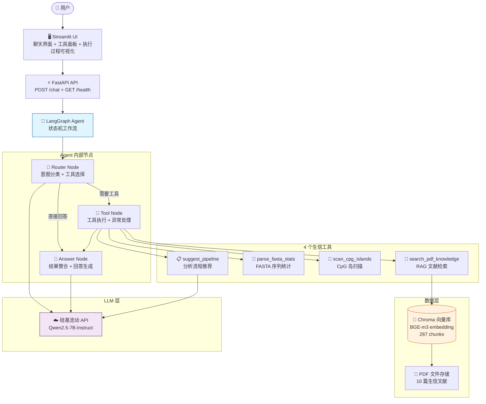
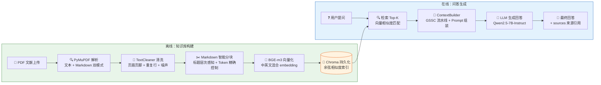
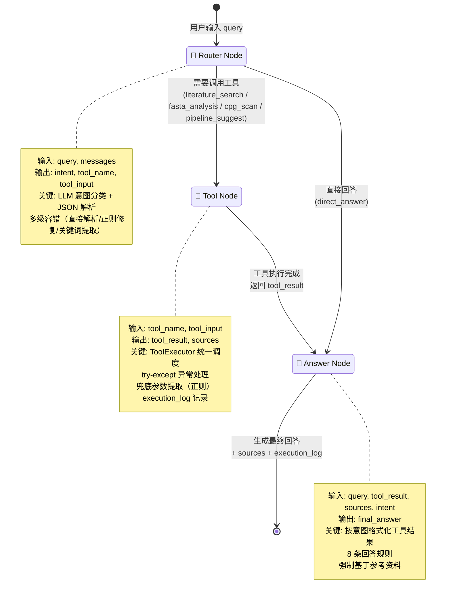
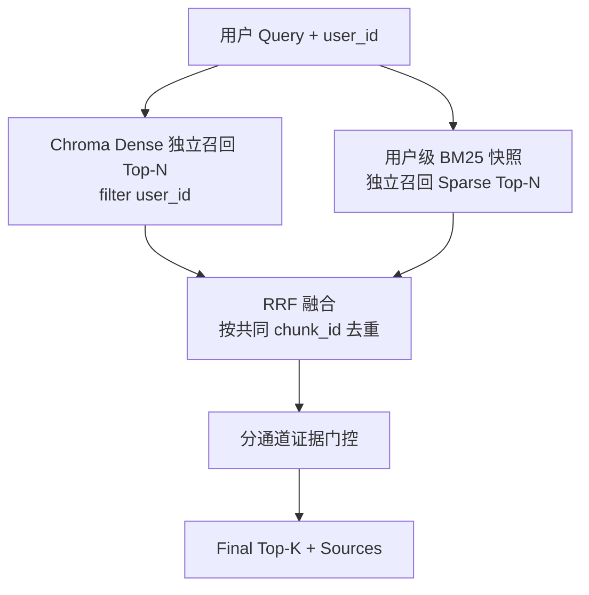

# PlantGenome Agent - 架构图

> 3 张核心架构图，用 Mermaid 格式编写，可直接在 GitHub / Typora / VS Code 中渲染。
> 如果需要 PNG 图片，可以用 https://mermaid.live 导出。

---

## 图 1：系统架构图（System Architecture）

展示用户 → 前端 → 后端 → Agent → 数据层的完整链路。

---

## 图 2：PDF RAG 流程图（PDF RAG Pipeline）

展示从 PDF 上传到回答生成的完整 RAG 流水线，对应 Hello Agents 第8章。

**RAG 流水线关键步骤说明：**

| 步骤 | 模块 | 对应教程 | 说明 |
|------|------|---------|------|
| 1. 文档载入 | PDFParser | 第8章 8.3.1 | PyMuPDF 页级提取，支持纯文本和 Markdown 双模式 |
| 2. 文本清洗 | TextCleaner | 第8章 8.3.2 | 两阶段清洗，9 个噪声正则，去除页眉页脚和重复行 |
| 3. 智能分块 | Chunker | 第8章 8.3.3 | Markdown 标题层次感知 + 段落语义保持 + BGE-m3 Token 精确控制 + 智能 overlap |
| 4. 向量化 | VectorStore | 第8章 8.3.4 | BGE-m3 embedding，Chroma 持久化，余弦相似度 |
| 5. 检索 | Retriever | 第8章 8.3.5 | Top-K 检索，MQE/HyDE 预留接口，sources 组装 |
| 6. 上下文工程 | ContextBuilder | 第9章 | GSSC 流水线（Gather → Select → Sort → Compose），Token 预算控制 |
| 7. 生成 | RAGGenerator | 第8章 8.3.6 | LLM 生成回答，强制基于参考资料，防幻觉 |

---

## 图 3：Agent 状态机图（Agent State Machine）

展示 LangGraph Agent 的状态流转，对应 Hello Agents 第6章。

**AgentState 状态字段：**

| 字段 | 类型 | 说明 |
|------|------|------|
| query | str | 用户原始问题 |
| messages | list | 对话历史（MVP 单轮） |
| execution_log | list | 执行日志（每个节点的耗时、状态、错误） |
| intent | str | 分类意图（5 类） |
| tool_name | str | 选中的工具名 |
| tool_input | dict | 工具输入参数 |
| tool_result | any | 工具执行结果 |
| sources | list | 文献来源引用 |
| final_answer | str | 最终回答 |

**5 类意图：**

| 意图 | 工具 | 说明 |
|------|------|------|
| literature_search | search_pdf_knowledge | 文献/概念/方法问题 |
| fasta_analysis | parse_fasta_stats | FASTA 序列统计 |
| cpg_scan | scan_cpg_islands | CpG 岛扫描 |
| pipeline_suggest | suggest_pipeline | 分析流程推荐 |
| direct_answer | （无） | 直接回答，不调用工具 |

---

## 图 4：检索模式与用户级全库 BM25（Retrieval Modes）

系统支持三种可配置、可回滚的检索模式，由环境变量 `RETRIEVAL_MODE` 控制：

| 模式 | Dense 召回 | BM25 召回范围 | 说明 |
|------|-----------|--------------|------|
| `dense_only` | Chroma Top-K | 不使用 | 纯向量检索，最简单 |
| `candidate_rrf`（默认） | Chroma Top-K×5 | **仅在 Dense 候选内** | BM25 只能重排候选，无法补回 Dense 漏召回 |
| `global_rrf` | Chroma 全库 Top-N | **用户全库独立 Top-N** | Dense / Sparse 各自独立召回后 RRF 融合 |

非法配置值保守回退 `candidate_rrf`；运行期异常最终兜底 `dense_only`，检索接口不直接崩溃。

**用户级 BM25 快照（`app/rag/bm25_snapshot.py`）**

- 快照内容：`user_id`、`corpus_version`、`built_at`、`BM25Index`、chunk_id → 正文/元数据映射。
- 数据源：从 SQL 经 `documents JOIN document_chunks` 加载，只含该用户、`status='completed'`、正文非空、`chroma_id` 非空的 chunk；不加载其他用户数据，也不从 Dense 候选构建。
- 进程内懒加载，用户级锁（SingleFlight）防并发重复构建，构建成功后原子替换；构建失败保留旧快照并标记 `stale`。

**跨进程失效（Redis 版本键）**

API 与 ARQ Worker 是不同进程，不能共享 Python 内存。版本键 `rag:bm25:version:{user_id}`：

- API 使用快照前比对 Redis 版本，版本变化则重建；
- Worker 在 SQL + Chroma 均入库成功后递增版本；删除成功后也递增；失败路径不误递增；
- Redis 不可用时降级为进程内 TTL（默认 300s）判断，并记录警告，不阻断检索。

**当前边界与限制**

- 融合键为 `chroma_id`，规则 `doc{document_id}_chunk{index}`，在当前文档代次内可用；重新切分后身份不保证稳定，稳定 UUID 属后续演进。
- BM25 tokenizer 为英文/数字词法匹配，**不支持中文分词**：纯中文 query 的词法召回会失效（见 failure_cases.md case 18）。
- 快照为进程内状态，当前方案适用于单机多进程；多实例水平扩展需演进为共享索引或集中式词法服务。
- 历史 `data/chroma` 早期向量（SQL 无对应记录、ID 含 UUID）未纳入本次升级验证；三模式评估基于隔离环境中重新规范入库的语料。

---

## 如何导出为 PNG

1. 打开 https://mermaid.live
2. 把上面的 Mermaid 代码粘贴进去
3. 点击 "Actions" → "Export PNG"
4. 保存到 `docs/images/` 目录

---

*PlantGenome Agent Architecture · D15*
